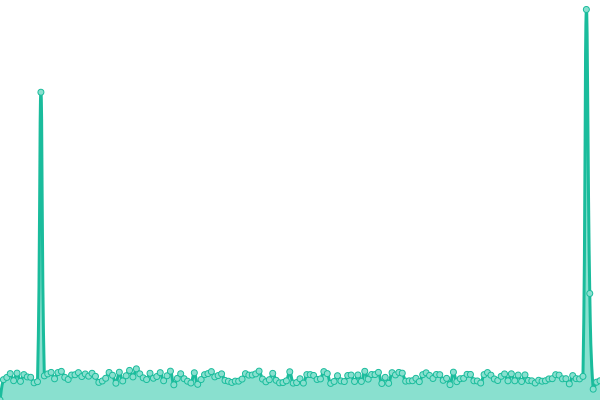
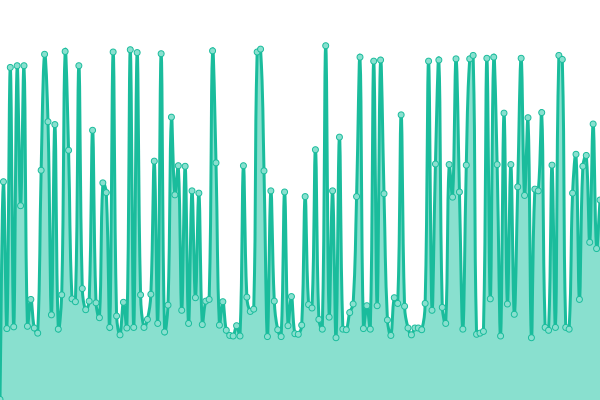
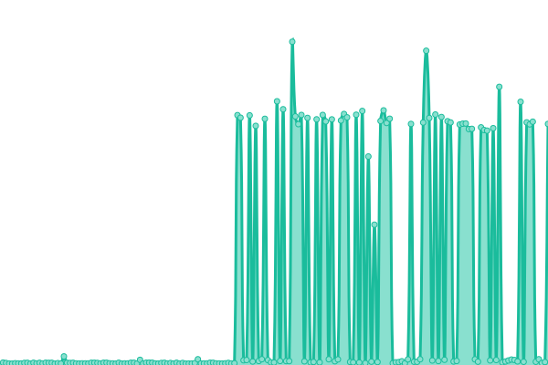
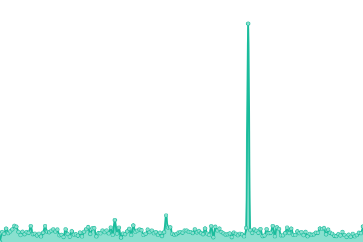
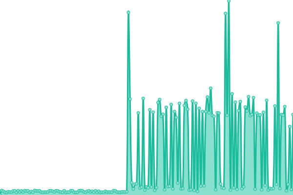

# [📈 Live Status](https://status.misafirmind.com): <!--live status--> **🟧 Partial outage**

This repository contains the open-source uptime monitor and status page for [Donut Insights](https://status.misafirmind.com), powered by [Upptime](https://github.com/upptime/upptime).

With [Upptime](https://upptime.js.org), you can get your own unlimited and free uptime monitor and status page, powered entirely by a GitHub repository. We use [Issues](https://github.com/Donut-Insights/misafirmind-upptime/issues) as incident reports, [Actions](https://github.com/Donut-Insights/misafirmind-upptime/actions) as uptime monitors, and [Pages](https://status.misafirmind.com) for the status page.

<!--start: status pages-->
<!-- This summary is generated by Upptime (https://github.com/upptime/upptime) -->
<!-- Do not edit this manually, your changes will be overwritten -->
<!-- prettier-ignore -->
| URL | Status | History | Response Time | Uptime |
| --- | ------ | ------- | ------------- | ------ |
|  [orchestrator](https://api.misafirmind.com/messorch/actuator/health) | 🟥 Down | [orchestrator.yml](https://github.com/Donut-Insights/misafirmind-upptime/commits/HEAD/history/orchestrator.yml) | 

 587ms
     
 | 

<a href="https://status.misafirmind.com/history/orchestrator">100.00%</a>
    

|  [chat](https://api.misafirmind.com/chatflow/health) | 🟥 Down | [chat.yml](https://github.com/Donut-Insights/misafirmind-upptime/commits/HEAD/history/chat.yml) | 

 263ms
     
 | 

<a href="https://status.misafirmind.com/history/chat">100.00%</a>
    

|  [llm](https://api.misafirmind.com/agentflow/health) | 🟥 Down | [llm.yml](https://github.com/Donut-Insights/misafirmind-upptime/commits/HEAD/history/llm.yml) | 

 127ms
     
 | 

<a href="https://status.misafirmind.com/history/llm">100.00%</a>
    

|  [dashboard](https://api.misafirmind.com/maestro/health) | 🟥 Down | [dashboard.yml](https://github.com/Donut-Insights/misafirmind-upptime/commits/HEAD/history/dashboard.yml) | 

 148ms
     
 | 

<a href="https://status.misafirmind.com/history/dashboard">100.00%</a>
    

|  [go](https://api.misafirmind.com/go/health) | 🟥 Down | [go.yml](https://github.com/Donut-Insights/misafirmind-upptime/commits/HEAD/history/go.yml) | 

 127ms
     
 | 

<a href="https://status.misafirmind.com/history/go">100.00%</a>
    

|  [survey](https://api.misafirmind.com/survey/health) | 🟩 Up | [survey.yml](https://github.com/Donut-Insights/misafirmind-upptime/commits/HEAD/history/survey.yml) | 

 128ms
     
 | 

<a href="https://status.misafirmind.com/history/survey">100.00%</a>
    

<!--end: status pages-->

[**Visit our status website →**](https://status.misafirmind.com)

## 📄 License

- Powered by: [Upptime](https://github.com/upptime/upptime)
- Code: [MIT](./LICENSE) © [Anand Chowdhary](https://anandchowdhary.com), supported by [Pabio](https://pabio.com)
- Data in the `./history` directory: [Open Database License](https://opendatacommons.org/licenses/odbl/1-0/)
